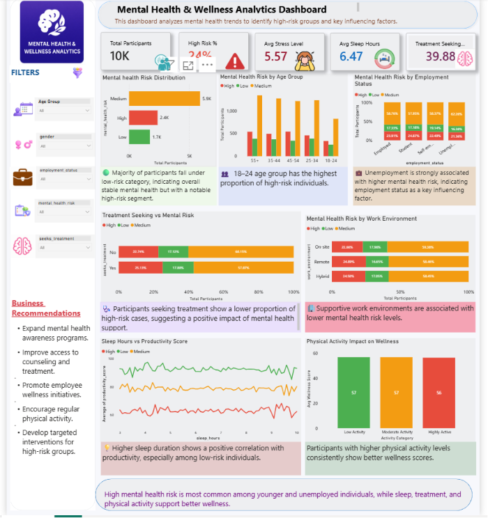

# Mental-Health-Analytics-Dashboard
Analyzing employee mental health, wellness scores, stress levels, sleep patterns, and workplace productivity using Python ,SQL and Power BI.

## Project Overview

This project analyzes employee mental health and workplace wellness using Power BI and Python. The objective is to identify factors affecting employee well-being, productivity, and mental health risk levels.

## Business Problem

Organizations often struggle to identify factors contributing to employee stress, burnout, and reduced productivity. This dashboard helps uncover patterns related to wellness scores, sleep habits, stress levels, and mental health risk.

## Tools Used

* Power BI
* Python
* Pandas
* Matplotlib
* Jupyter Notebook

## Key KPIs

* Total Employees
* Average Wellness Score
* Average Productivity Score
* Average Sleep Hours
* Mental Health Risk Distribution

## Dashboard Preview

## Key Insights

* Employees with lower sleep hours tend to have lower wellness scores.
* High stress levels are associated with increased mental health risk.
* Productivity decreases as stress levels increase.
* Certain employee groups show higher risk and require targeted support.

## Recommendations

* Promote healthy sleep habits through wellness programs.
* Implement stress management initiatives.
* Conduct regular mental health assessments.
* Provide employee support and counseling resources.

## Files Included

* Power BI Dashboard (.pbix)
* Python Notebook (.ipynb)
* Business Insights Report (.pdf)
* Dataset (.csv)

## Author

Sunny Verma
Aspiring Data Analyst
